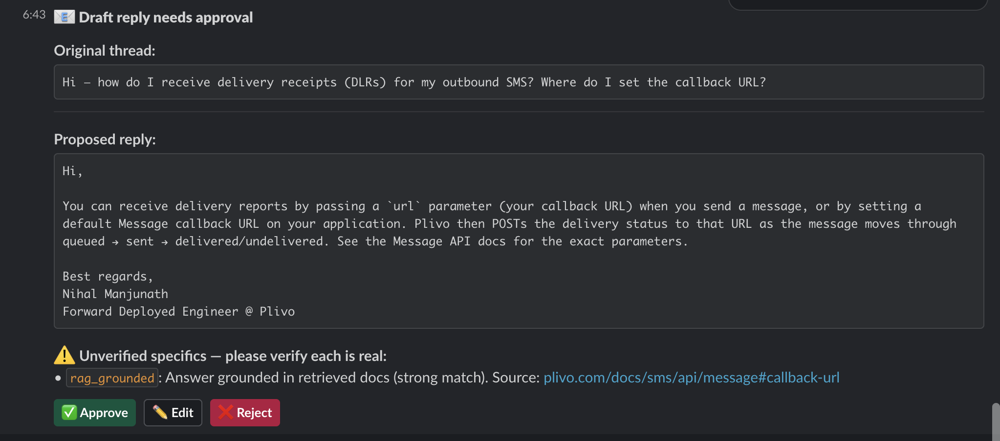
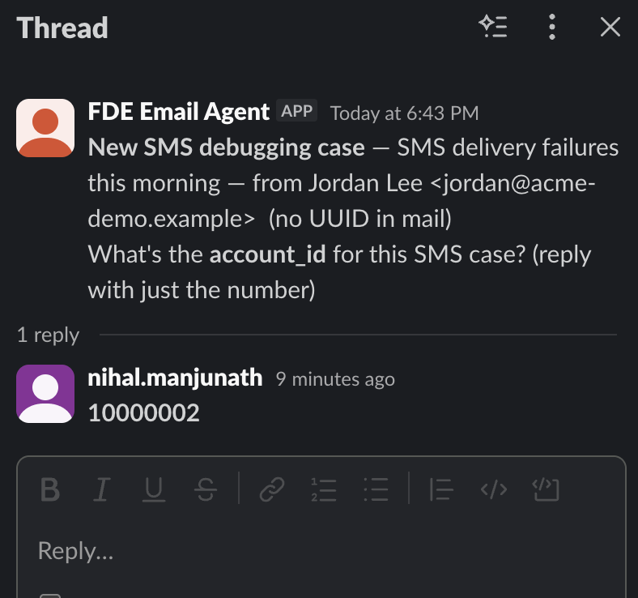
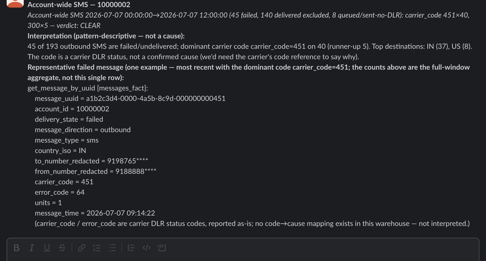
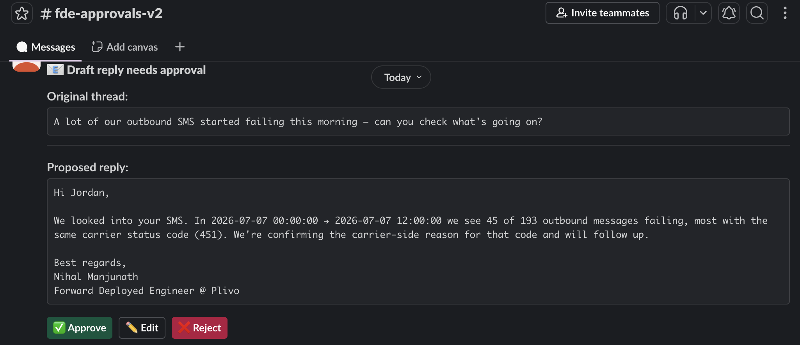
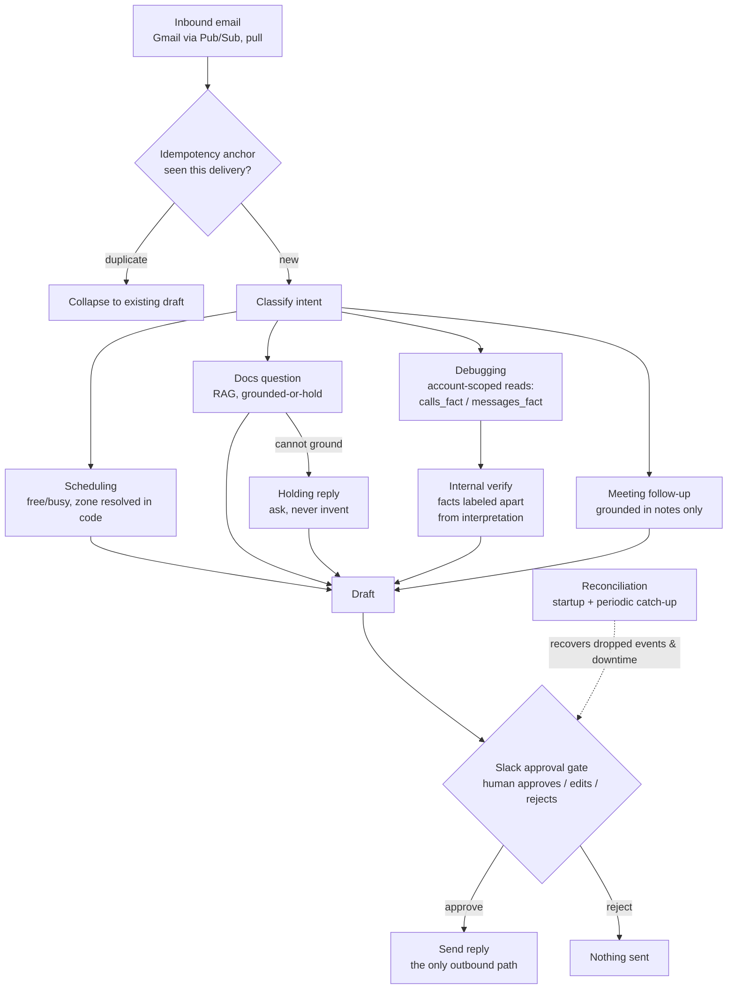

# Email agent for customer-support workflows

> 🎥 **Demo:** [Loom walkthrough](LOOM_URL_HERE) — _link coming soon_

An autonomous email assistant for a solutions engineer at a CPaaS company. It reads an
incoming customer thread, works out what the customer needs, gathers whatever grounding it
can (product documentation, the account's own call and message records, calendar
availability), drafts a reply, and posts that draft to a human for approval in Slack.
Nothing is sent, booked, or written back to a customer until a person approves it. The same
engine drives the outbound side, post-meeting follow-ups drafted from meeting notes.

It is one service with a shared toolbox rather than a pile of separate automations. Every
message flows through the same loop: ingest the whole thread, classify intent, gather
context, draft, route for approval, and act only once approved. What changes from case to
case is which tools it reaches for and which guidance it follows, never the shape of the
loop or the position of the human.

This repository is a sanitized public release of a system in daily production use. The
architecture, guarantees, and tests are intact; only employer-specific schema names and real
customer data have been replaced with generic equivalents.

## What it handles

Ordinary support replies are answered only from retrieved product documentation. If the
docs support an answer, it drafts one and cites them; if they do not, it holds and asks a
clarifying question instead of inventing a response.

Scheduling requests are resolved against the engineer's real calendar. The agent parses the
requested time, checks working hours and free/busy, and either drafts a confirmation with a
booking attached or proposes nearby open slots. Time zones are resolved in code, not left to
the model, and when a customer names a bare time the draft states the assumption it made.

Debugging requests are the most involved case. When a customer reports failing calls or
messages, the agent pulls that account's records from the analytics warehouse, renders the
facts, forms a hypothesis, and routes the case for human verification before anything reaches
the customer. It never asserts a cause the data cannot support; when the warehouse genuinely
cannot answer a question it escalates rather than guessing.

Meeting follow-ups are drafted from the notes of a call, grounded only in what the notes
recorded, and addressed to the right thread by matching the meeting's external attendees.

All of it lands as a draft at a single Slack approval gate, where the engineer approves,
edits, or rejects. Approval is the only path to an outbound action.

## What it looks like

Every action surfaces in Slack for human approval — nothing reaches a customer unattended.

*Platform questions are answered **only** from retrieved docs (grounded-or-hold): the card shows the drafted answer with its source, and no draft sends without a person.*

*The agent never resolves account identity from email content — it asks a human for the account id, and every warehouse query is account-scoped in code.*

*Debugging runs on **exact** warehouse aggregates (immune to recency truncation flipping the verdict), labels **grounded facts** separately from **interpretation**, and reports carrier codes verbatim — never guessing a cause from a code.*

*The customer-facing draft states only what the data shows — no invented commitment or cause (the failure mode this guards against) — and still waits for approval before it sends.*

## Design rationale

LLM agents fail in three characteristic ways. Most of this codebase is structure built to
make each failure impossible rather than merely unlikely, and the tests exist to prove the
guards fire on the day the model misbehaves.

The first failure is fabrication, a confident answer that is not true. The defense is
grounded-or-hold: customer-facing claims come only from retrieved documents or from the
account's own records, checked by an answerability gate and a groundedness gate, and a draft
that cannot be grounded becomes a holding reply rather than a plausible guess. Where the
content is structured data, the facts are rendered from query results by code, not narrated
by the model. The debugging path takes this furthest. It reports what the records show,
labels its interpretation as a hypothesis, and sends the case to a human verification step;
a question the warehouse cannot answer produces an honest escalation, never an invented
cause.

The second failure is unbounded action, an agent that sends, books, or writes on its own.
The defense is that approval is structural, not advisory. There is no auto-send path in the
system at all. Read tools run freely; any tool that acts on the outside world executes only
after a human approves the specific draft. Access to an account's private data is scoped in
code to the verified sender, and that scope is injected by the application rather than chosen
by the model, so untrusted email text cannot widen it. The warehouse client is read-only and
rejects anything that is not a SELECT.

The third failure is silent loss, work that vanishes when a connection drops or a process
restarts. The defense is to treat delivery as unreliable and reconcile. Every processed
message carries an idempotency anchor, so a redelivered notification collapses to one draft
instead of duplicating. Startup and periodic catch-up passes recover anything that arrived
during downtime. A dropped realtime event is picked up by reconciliation rather than lost.
The anchor itself encodes artifact identity, not just the triggering message, so a single
mail can legitimately produce several distinct artifacts (a first reply, a debugging answer,
a follow-up) without one silently overwriting another. When an availability check errors, the
system holds rather than asserting a false answer.

Two further properties support the rest. Guards are verified by injection: tests feed the
system a misbehaving model output and assert the guard catches it, rather than observing the
guard sit quietly while the model happens to behave. And the system learns from correction
under the same gate architecture as everything else. It watches the edits a human makes to
its drafts, proposes candidate style rules and candidate knowledge-base facts, and applies
none of them until the human ratifies each one; ratified style rules are versioned and
revocable, and ratified facts join the retrieval corpus and inherit its grounding and citation
discipline.

## Architecture

Two long-running processes. A worker pulls new mail (Gmail over Pub/Sub, in pull mode, so no
public inbound endpoint is required), classifies it, drafts through the appropriate path, and
posts the draft to Slack. A listener holds a Socket Mode connection for the approval actions
and for asynchronous replies in the internal channels. Keeping ingest and interaction in
separate processes means either can restart without the other losing work, which is what makes
reconciliation tractable.

Postgres is the system of record: per-thread scheduling and case state, the full audit log of
every email, classification, draft, human edit, and sent version, the idempotency anchors, the
ratified style rules, and a pgvector corpus of product documentation for retrieval. A separate
read-only client speaks the Postgres wire protocol to an analytics warehouse and exposes
account-scoped call and message lookups for the debugging path.

Model access lives behind one wrapper module. Nothing else in the codebase talks to the model
vendor directly, so the provider can be changed in a single file without the rest of the system
knowing.

## How it works

Every message follows the one loop — ingest → classify → gather grounding → draft → **human approval** → act. What changes per case is which tools are reached for and which guidance is followed; the position of the human never moves.

## Running it

Requires Python 3.11 or newer, and Postgres and Redis, which come up through docker compose.
Copy `.env.example` to `.env` and provide an OpenAI key, Slack bot and app tokens with a
Socket Mode app, Gmail OAuth credentials, and read-only warehouse credentials. `./start.sh`
brings up the datastores, registers the Gmail watch, and launches the worker and listener;
`./stop.sh` stops them. The test suite runs with `pytest`; it mocks the external services at
their seams, and a few tests exercise a local Postgres.

## Caveats

This is a single-user system by design. It serves one engineer's mailbox and calendar, and its
account-scoping model assumes that. It does nothing live without real credentials for each
external service. The warehouse table and column names in this repository are generic
stand-ins for a real support-analytics schema; the query structure and access discipline are
the point, not the names.
